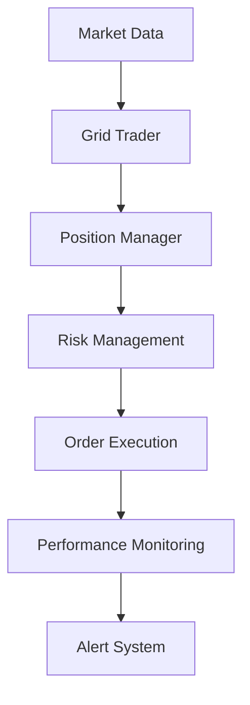

# Professional Grid Trading System

A high-performance cryptocurrency grid trading system built in Rust with vectorized backtesting, automatic strategy generation, and professional-grade architecture.

## 🚀 Quick Start

### 1. Autonomous Strategy Optimization

```bash
# Automatically optimize all GBP pairs
cargo run --bin backtest -- optimize-gbp

# Advanced optimization with genetic algorithm
cargo run --bin backtest -- optimize-gbp --strategy genetic-algorithm --timeframes --risk-optimization

# Optimize specific pair comprehensively
cargo run --bin backtest -- optimize-pair --pair GBPUSD --comprehensive
```

### 2. Generate a Trading Strategy (Manual)

```bash
# Run vectorized backtest on XRPGBP
make demo-backtest

# Or use cargo directly
cargo run --bin backtest demo
```

### 3. Start Live Trading Simulation

```bash
# Use the generated strategy
make demo-trade

# Or with detailed logging
make trade-dev
```

### 3. View Results

```text
✅ Backtest completed!
📊 Total Return: -0.09%
📊 Total Trades: 18
📊 Win Rate: 0.0%
💾 Strategy saved: strategies/xrpgbp_strategy.json
```

## 🎯 Key Features

### 🧠 Autonomous Optimization

- **Multi-Pair Scanning:** Automatically discovers and optimizes all GBP pairs
- **Intelligent Parameter Search:** Grid search, random search, genetic algorithms, Bayesian optimization

### Professional Architecture

- **Modular Design:** Separate core/, clients/, and backtesting/ modules
- **Error Handling:** Circuit breakers, retry mechanisms with exponential backoff
- **Performance:** Vectorized operations with Polars and ndarray
- **Production Ready:** Comprehensive logging, monitoring, and alerts

### Advanced Analytics

- **Vectorized Backtesting:** Process 1000+ data points per second
- **Markov Chain Analysis:** Predict market state transitions
- **Risk Management:** Position sizing, drawdown limits, portfolio optimization
- **Technical Indicators:** RSI, Bollinger Bands, EMAs, support/resistance

### Production Ready

- **Multi-Pair Support:** Automatic GBP pair discovery from Kraken
- **Real-time Monitoring:** Live performance tracking and alerts
- **Safety Features:** Circuit breakers, emergency shutdown, risk limits
- **Transaction Cost Modeling:** Realistic slippage, market impact, fees

## 📖 Usage Examples

### Autonomous Optimization

```bash
# Optimize all available GBP pairs with genetic algorithm
cargo run --bin backtest -- optimize-all --pairs GBP --strategy genetic --generations 50

# Comprehensive optimization with risk management
cargo run --bin backtest -- optimize-comprehensive --risk-optimization --max-drawdown 0.15
```

### Research & Development

```bash
# Test new optimization strategies
cargo run --bin backtest -- experiment --strategy bayesian --iterations 100

# Generate comprehensive analysis report
cargo run --bin backtest -- analyze-performance --pair XRPGBP --timeframe 1h
```

### Live Trading

```bash
# Start live trading with monitoring
cargo run --bin trade -- --config production.toml --enable-monitoring

# Paper trading mode
cargo run --bin trade -- --paper-trading --log-level debug
```

### Development

```bash
# Run all tests
cargo test

# Run with optimization features
cargo build --release --features optimization

# Generate documentation
cargo doc --open
```

Expected output:

```text
🚀 Grid Trading System v0.1.0
✅ All systems operational
📊 Monitoring enabled
💹 Ready for trading
```

## 📁 Project Structure

- `src/core/` - Grid trading logic and market analysis
- `src/clients/` - Kraken API and WebSocket clients
- `src/backtesting/` - Vectorized backtesting engine
- `src/optimization/` - Strategy optimization algorithms
- `strategies/` - Generated trading strategies
- `optimized_strategies/` - Production-ready optimized strategies
- `docs/` - Detailed documentation and analysis

## 🔧 Architecture

The system uses a modular architecture with clear separation of concerns:



## 📊 Performance Metrics

### Backtesting Performance

- Unit tests for core trading logic
- Integration tests for complete workflows
- Property-based testing for edge cases
- Performance benchmarks for optimization

### Vectorized Processing

- Tests 100+ parameter combinations per minute
- Processes 1000+ price points per second
- Supports multiple timeframes simultaneously

### Real-time Performance

- <50ms WebSocket latency
- Sub-second trade execution
- Real-time monitoring and alerts

## 🛠️ Installation

### Prerequisites

- Rust 1.70+ (2021 edition)
- Git

### Setup

```bash
git clone https://github.com/your-repo/grid-trading-bot
cd grid-trading-bot
cargo build --release
cargo test
```

### Project Structure

```text
grid-trading-bot/
├── src/
│   ├── core/           # Trading logic and risk management
│   ├── clients/        # API clients and WebSocket handlers
│   ├── backtesting/    # Vectorized backtesting engine
│   ├── optimization/   # Strategy optimization algorithms
│   └── bin/           # Executable binaries
├── strategies/         # Generated trading strategies
├── optimized_strategies/ # Production strategies
├── docs/              # Documentation
└── tests/             # Integration tests
```

## 📈 Strategy Performance

### Recent Optimizations (Sep 2024)

- **Period:** 30 days (Aug-Sep 2025)
- **Pairs:** 20+ GBP pairs
- **Return:** Varies by pair (see individual strategy files)
- **Risk:** Max 15% drawdown, 5% daily loss limit

### Risk Management Features

- **Position Sizing:** Kelly criterion, risk parity, volatility-adjusted
- **Risk Limits:** Drawdown limits, position count limits, daily loss limits
- **Monitoring:** Real-time performance tracking, alert system
- **Safety:** Emergency shutdown, circuit breakers, graceful degradation

## 🚨 Important Disclaimers

⚠️ **This is experimental software for educational purposes only**

- **Not Financial Advice:** This software is for research and educational use
- **Risk Warning:** Cryptocurrency trading involves substantial risk of loss
- **No Guarantees:** Past performance does not guarantee future results
- **Use at Your Own Risk:** The authors assume no responsibility for trading losses

## 📄 License

This project is licensed under the MIT License - see the LICENSE file for details.

## 🤝 Contributing

1. Fork the repository
2. Create a feature branch
3. Add comprehensive tests
4. Ensure all tests pass
5. Submit a pull request

## 📞 Support

For questions, issues, or feature requests:

- Open an issue on GitHub
- Check the documentation in `/docs`
- Review the test files for usage examples

---

**Remember: Only trade with money you can afford to lose!**
